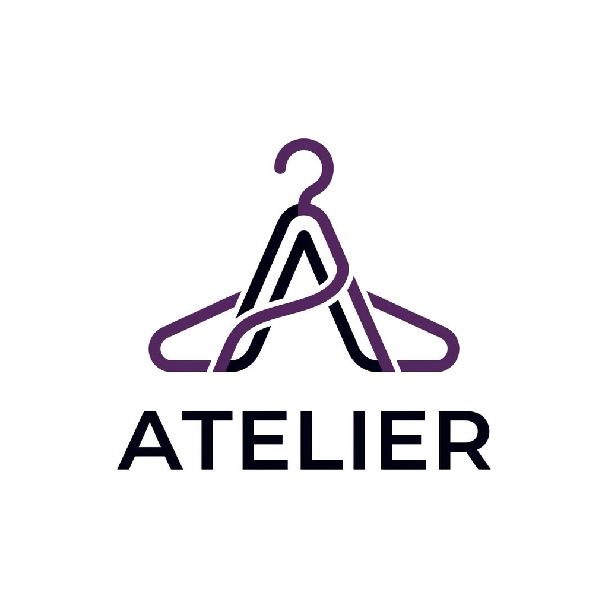

# 🧥 Atelier
### *Your Private Digital Wardrobe Studio*

Atelier is a high-end, AI-powered wardrobe management platform designed for the modern fashion enthusiast. It transforms your physical closet into a digital experience, helping you organize, discover, and style your clothing with precision and aesthetic elegance.



## ✨ Key Features

- **📂 Digital Closet**: Catalog your entire wardrobe with high-quality images and detailed metadata.
- **🪄 Smart Combos**: AI-driven outfit recommendations that pair your items into stunning looks.
- **💾 Saved Outfits**: Archive your favorite combinations for different occasions (Date Night, Professional, Casual).
- **📊 Wardrobe Analytics**: Track your closet statistics and most-used items directly from the dashboard.
- **📱 Hybrid Layout**: A premium floating sidebar for desktop and an ergonomic bottom navigation bar for mobile.

## 🎨 Design Philosophy

Atelier follows a **Neutral Dark (Graphite)** aesthetic, inspired by high-end fintech and pro-productivity tools.
- **Deep Palette**: Using `#09090b` (Background) and `#111114` (Cards) for a sophisticated, low-distraction environment.
- **Fintrack Aesthetic**: Subtle borders, soft `2xl` rounding, and consistent primary blue accents (`#5865f2`).
- **Precision Typography**: Clean, modern sans-serif hierarchy for maximum readability.

## 🛠️ Tech Stack

- **Frontend**: [React 18](https://reactjs.org/) + [Vite](https://vitejs.dev/)
- **Styling**: [Tailwind CSS](https://tailwindcss.com/) with modern CSS variables.
- **Backend/Auth**: [Supabase](https://supabase.com/) (PostgreSQL + RLS Policies)
- **Storage**: Supabase Buckets for high-performance image hosting.
- **Icons**: [Lucide React](https://lucide.dev/) for crisp, minimalist iconography.

## 🚀 Getting Started

### Prerequisites
- Node.js (v18+)
- A Supabase account and project.

### Installation

1. **Clone the repository**
   ```bash
   git clone https://github.com/pratikshit19/Atelier.git
   cd Atelier
   ```

2. **Install dependencies**
   ```bash
   npm install
   ```

3. **Environment Setup**
   Create a `.env` file in the root directory and add your Supabase credentials:
   ```env
   VITE_SUPABASE_URL=your_supabase_url
   VITE_SUPABASE_ANON_KEY=your_supabase_anon_key
   ```

4. **Run the development server**
   ```bash
   npm run dev
   ```

## 📜 Database Schema

The project uses a clean relational schema in PostgreSQL:
- `items`: Individual clothing pieces with category and image links.
- `outfits`: Collections of items representing a complete look.
- `outfit_items`: Junction table for many-to-many relationships between items and outfits.

---

*Built with passion for fashion and technology. © 2026 Atelier Studio.*
